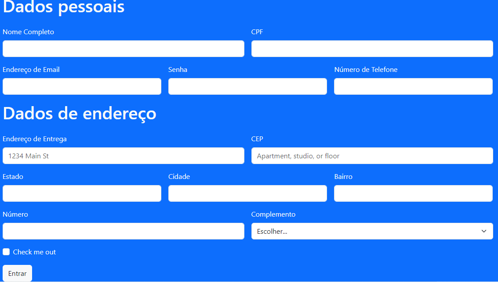

# indice

* [Form CadEcommerce](#form CadEcommerce)
* [Descrição](#descrição)
* [Introdução](#introdução)
* [Sites Consultados](#Sites-consultados)
* [Funcionalidades](#funcionalidades)
* [Tecnologias Utilidades](#tecnologias-utilizadas)
* [Fontes Consultadas](#fontes-consultadas)
* [Autores](#autores)

# form-CadEcommerce

## Descrição 📖
- Este projeto consiste na criação de um site de cadastro de clientes, inspirado em elementos encontrados em três sites de e-commerce. O site permite aos usuários fornecer informações essenciais, como nome, endereço e detalhes de contato, simplificando o processo de registro. Este trabalho destina-se a demonstrar nossas habilidades em HTML e nossa capacidade de sintetizar informações de várias fontes para desenvolver uma solução única.

## Introdução ✉️
- Preenchimento de dados em um formulário de cadastro para compra em um site de Ecommerce

## Sites Consultados 
- Os sites explorados nessa pesquisa foram:
- [Nike](https://www.nike.com.br/)
- [Mercado Livre](https://www.mercadolivre.com.br/)
- [Amazon](https://www.amazon.com.br/)
- Todos em busca de inspiração e variedade, que possiblitaram na criação do nosso próprio Formulário de Ecommerce 

## Funcionalidades 🧠
- Aprender a construir uma tabela de formulário para cadstro em sites de Ecommerce em HTML5

## Tecnologias Utilizadas 🖥️   
- Visual Studio Code; 
- CSS3; 
- HTML5; 
- Github; 

## Fontes Consultadas 🔗
- [boot strap](https://getbootstrap.com/)

## Autores 👥
- [João Pedro Gonçalves](https://github.com/s-pedro13)
- [Nicolas Tonassi](https://github.com/nicolas-tonassi)

